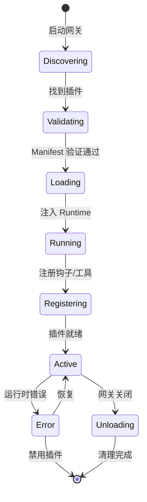

# 插件化架构 Skill

## Triggers

### When to use
- 当需要支持第三方插件扩展系统功能时
- 当系统需要模块化设计，允许功能按需加载时
- 当需要隔离核心代码与扩展功能时
- 当需要提供插件 SDK 和运行时 API 时

### When NOT to use
- 当系统功能简单，不需要扩展时
- 当性能要求极高，插件加载可能影响启动时间时
- 当安全要求极高，不允许第三方代码执行时

## Input

| Parameter | Type | Description | Required |
|-----------|------|-------------|----------|
| pluginPath | string | 插件目录路径 | true |
| pluginId | string | 插件唯一标识符 | true |
| runtimeVersion | string | 运行时版本要求 | true |
| dependencies | object | 插件依赖项 | false |
| channels | array | 插件支持的通道类型 | false |
| tools | array | 插件提供的工具 | false |

## Output

| Parameter | Type | Description |
|-----------|------|-------------|
| pluginRegistry | object | 插件注册表，包含所有已加载的插件 |
| pluginRuntime | object | 插件运行时 API 实例 |
| loadedPlugins | array | 成功加载的插件列表 |
| error | string | 加载过程中的错误信息 |

## Steps

1. **创建插件 SDK**
   - 定义插件类型和接口
   - 实现配置 Schema 构建器
   - 提供工具函数和文档链接助手

2. **实现插件运行时**
   - 提供通道操作 API
   - 提供日志 API
   - 提供状态管理 API
   - 提供媒体处理 API

3. **开发插件加载器**
   - 实现插件发现机制
   - 验证插件 Manifest
   - 注入运行时 API
   - 注册插件钩子和工具

4. **构建插件注册表**
   - 按 ID 索引插件
   - 按通道类型索引插件
   - 管理钩子注册
   - 管理工具注册

5. **创建插件实现模板**
   - 提供通道连接器模板
   - 提供自定义工具模板
   - 提供自动化钩子模板

6. **配置插件系统**
   - 配置插件目录路径
   - 配置允许和禁用的插件
   - 配置插件权限

7. **测试插件系统**
   - 测试插件加载流程
   - 测试插件与核心的交互
   - 测试插件间的通信
   - 测试插件故障隔离

## Failure Strategy

- **插件加载失败**：记录错误日志，跳过该插件，继续加载其他插件
- **插件运行时错误**：隔离错误，不影响核心功能，记录错误日志
- **插件权限不足**：拒绝插件访问敏感 API，记录警告日志
- **插件版本不兼容**：拒绝加载版本不兼容的插件，记录错误日志

## 核心理念

**隔离优先，稳定 API**

- 插件与核心代码完全隔离
- 通过 SDK 提供编译时类型
- 通过 Runtime 提供运行时能力
- 禁止插件直接导入核心模块

## 架构层次

```
┌─────────────────────────────────────┐
│         插件 SDK (plugin-sdk/)      │
│  - 类型定义                          │
│  - Config Schema 构建器                │
│  - 工具函数                          │
│  - 文档链接助手                      │
└─────────────────────────────────────┘
                 ↓
┌─────────────────────────────────────┐
│       插件 Runtime (runtime.ts)     │
│  - 通道操作 API                      │
│  - 日志 API                          │
│  - 状态管理 API                      │
│  - 媒体处理 API                      │
└─────────────────────────────────────┘
                 ↓
┌─────────────────────────────────────┐
│        插件加载器 (loader.ts)       │
│  - 发现插件                          │
│  - 验证 Manifest                     │
│  - 注入 Runtime                      │
│  - 注册钩子和工具                    │
└─────────────────────────────────────┘
                 ↓
┌─────────────────────────────────────┐
│         插件实现 (extensions/*)      │
│  - 通道连接器                        │
│  - 自定义工具                        │
│  - 自动化钩子                        │
└─────────────────────────────────────┘
```

## 依赖关系

- **依赖模块**：配置系统、日志与可观测性、模块边界与依赖注入、CLI 系统
- **被依赖模块**：网关通信协议、会话管理、媒体处理架构、内存管理系统

## 插件生命周期



## 最佳实践

1. **API 稳定性**：SDK 语义化版本，Runtime 每版本编号
2. **最小权限**：插件只能访问显式注入的 API
3. **错误隔离**：插件错误不影响核心功能
4. **版本兼容**：插件声明所需 runtime 版本范围
5. **文档链接**：每个插件提供 docs.openclaw.ai 链接

## 性能考量

- **加载时间**：插件加载会影响网关启动时间
  - 优化：延迟加载插件
  - 避免：在启动时加载所有插件
- **内存使用**：每个插件会占用额外内存
  - 建议：限制插件数量和大小
  - 避免：加载不必要的插件

## 安全考量

- **插件隔离**：确保插件无法访问核心模块
- **权限控制**：限制插件的 API 访问权限
- **代码签名**：验证插件的代码签名
- **资源限制**：限制插件的 CPU 和内存使用

## 扩展点

- **自定义插件**：支持第三方开发的插件
- **插件市场**：提供插件市场和安装机制
- **插件更新**：支持插件自动更新
- **插件诊断**：提供插件诊断和调试工具

## References

- **核心实现**：详细的插件系统实现代码
- **配置示例**：插件配置和 Manifest 示例
- **插件实现示例**：WhatsApp 插件实现示例
- **测试策略**：单元测试、集成测试和端到端测试策略
